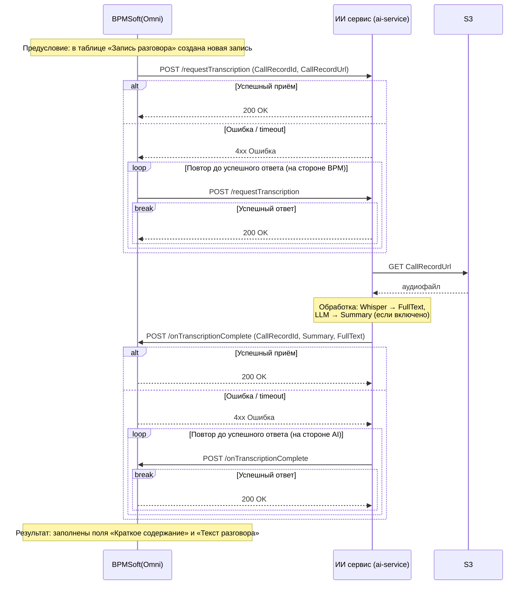

# ai-stt: BPM-Driven Speech-to-Text Service — Design Spec

**Date:** 2026-07-06
**Status:** Approved design. Supersedes `2026-07-05-ai-stt-pipeline-design.md` (S3-polling pipeline).

## 1. Purpose

BPMSoft (Omni) creates a record in the «Запись разговора» table and pushes a transcription request to the AI service. The AI service downloads the call audio from S3, transcribes it (Whisper), optionally generates a summary (LLM), and delivers both back to BPM via callback, which fills the record's «Краткое содержание» and «Текст разговора» fields.

Primary language: Russian.

**Workload (production figures):** ~850 calls/day, average recording ~5 minutes / ~4.5 MB, format **always MP3** (the API rejects anything else, §3.1).

**Capacity check:** 850 × 5 min ≈ 71 h of audio/day; faster-whisper `large-v3` on a GPU runs at ~10–20× realtime → ~3.5–7 h of GPU time/day. Average arrival is ~1 call per 100 s vs ~15–30 s processing per call, so the single sequential worker and one GPU are sufficient with ample headroom for peak-hour bursts (the durable queue absorbs them).

### Sequence



## 2. Architecture

Two services developed in this repo, plus one external dependency:

```
                 POST /requestTranscription
  BPMSoft ────────────────────────────────────┐
     ▲                                        ▼
     │ POST {BPM_CALLBACK_URL}   ┌─── Docker: ai-service (CPU) ───┐
     │ /onTranscriptionComplete  │ FastAPI + SQLite job queue     │
     └───────────────────────────│ + background worker            │
                                 └───┬──────────┬──────────┬─────┘
                       boto3 GET ────┘   HTTP   │          │ HTTP (optional)
                                 ▼              ▼          ▼
                            S3-compatible   whisper-api   LLM (external,
                            storage         (GPU/CPU,     OpenAI-compatible
                            (MinIO etc.)    this repo)    chat endpoint)
```

- **`ai-service`** — FastAPI app + SQLite-backed job queue + single background worker. Owns all integration: BPM API, S3 download, Whisper call, LLM call, callback delivery. No GPU, no ML dependencies (`fastapi`, `uvicorn`, `boto3`, `httpx`).
- **`whisper-api`** — REST service wrapping **faster-whisper**, runs on **GPU or CPU** (`DEVICE=cuda|cpu`). Exposes the transcription endpoint at `POST /v1/chat/completions` (the OpenAI `verbose_json` transcription contract, served on the chat/completions path — not the OpenAI chat schema). Unchanged role from the previous spec.
- **LLM** — any OpenAI-compatible `/v1/chat/completions` endpoint (self-hosted vLLM/Ollama). Running it is **out of scope**; only its URL/model/key are configured. Not needed when summarization is disabled.
- No auth on `/requestTranscription` and the callback — trusted internal network (v1).

## 3. Component: `ai-service`

### 3.1 HTTP API

#### `POST /requestTranscription`

Request body (JSON):

```json
{"CallRecordId": "3fa85f64-5717-4562-b3fc-2c963f66afa6", "CallRecordUrl": "s3://call-records/2026/07/rec-123.mp3"}
```

- `200 {"status": "accepted", "CallRecordId": "..."}` — job stored durably; it **will** eventually be processed and delivered (or marked `failed`).
- `400 {"detail": "..."}` — missing/empty `CallRecordId` or `CallRecordUrl`, non-JSON body, unparseable URL scheme, or a key that does not end in `.mp3`.
- **Idempotent by `CallRecordId`:** re-POST of an existing job returns `200` without creating a duplicate (BPM retries the request until it gets 200). A job in status `failed` is re-queued by the repeat request; in any other status the request is a no-op acknowledgment.

`CallRecordUrl` formats accepted (the key must end in `.mp3`, case-insensitive — recordings are always MP3):
- `s3://<bucket>/<key>.mp3`
- `http(s)://<s3-endpoint-host>/<bucket>/<key>.mp3` (path-style object URL; host is ignored, the configured `S3_ENDPOINT_URL` + credentials are used)

#### `GET /jobs/{CallRecordId}`

Diagnostics (the flow has no failure callback, so this is the visibility mechanism):
`200 {"CallRecordId": "...", "status": "queued|processing|delivering|done|failed", "attempts": 1, "error": null, "created_at": "...", "updated_at": "..."}` or `404`.

#### `GET /jobs/{CallRecordId}/result`

The transcript and summary of a job (empty strings until it reaches `delivering`/`done`):
`200 {"CallRecordId": "...", "status": "...", "Summary": "...", "FullText": "[00:00:00] ..."}` or `404`.

#### `GET /jobs`

List jobs, newest first, for diagnostics. Query params: `status` (optional filter over the five states), `limit` (1–500, default 50), `offset` (default 0).
`200 {"count": N, "jobs": [ {status object}, ... ]}`.

#### `GET /healthz`

`200 {"status": "ok"}` when the API and DB are up (does not depend on whisper-api/LLM availability).

### 3.2 Job queue (SQLite)

Single table `jobs`:

| column | type | notes |
|---|---|---|
| `call_record_id` | TEXT PRIMARY KEY | |
| `call_record_url` | TEXT | |
| `status` | TEXT | `queued` / `processing` / `delivering` / `done` / `failed` |
| `attempts` | INTEGER | permanent-error attempts (see §3.5) |
| `error` | TEXT NULL | last error message |
| `full_text` | TEXT NULL | stored before delivery so a restart never re-transcribes |
| `summary` | TEXT NULL | |
| `created_at`, `updated_at` | TEXT | UTC ISO-8601 |

DB file lives on a volume (`DB_PATH`). On startup, jobs stuck in `processing`/`delivering` are picked up again (`processing` restarts from download; `delivering` resumes callback delivery from the stored `full_text`/`summary`).

### 3.3 Processing pipeline (background worker, one job at a time)

1. Take the oldest `queued` job → status `processing`.
2. Parse `CallRecordUrl` → bucket/key; download the MP3 via boto3 (configured endpoint + credentials) to a temp file.
3. `POST {WHISPER_API_URL}/chat/completions` (multipart: file, `model`, `language`, `response_format=verbose_json`) → segments with start/end times.
4. Build **FullText** — one line per segment with a timecode:
   ```
   [00:00:00] Добрый день, компания Аэроклуб.
   [00:00:04] Здравствуйте, я по поводу брони.
   ```
   Timecode = segment start, format `[HH:MM:SS]`. Empty transcription → empty string.
5. Build **Summary**:
   - If `SUMMARY_ENABLED=false` → `""` (LLM is not called, LLM config not required).
   - Else `POST {LLM_API_URL}/chat/completions` with `model=LLM_MODEL`, `temperature=0.2`, messages: system = `SUMMARY_PROMPT` (default: «Составь краткое содержание телефонного разговора на русском языке: основная тема, договорённости, следующие шаги. Отвечай только текстом краткого содержания.»), user = plain transcript text (without timecodes). Response `choices[0].message.content` → Summary.
6. Store `full_text` + `summary` on the job → status `delivering`.
7. `POST {BPM_CALLBACK_URL}` body:
   ```json
   {"CallRecordId": "...", "Summary": "...", "FullText": "[00:00:00] ..."}
   ```
   On `200` → status `done`. Otherwise retry (see §3.5).

### 3.4 Configuration (environment variables)

| Variable | Default | Description |
|---|---|---|
| `S3_ENDPOINT_URL` | — (required) | S3-compatible endpoint |
| `S3_ACCESS_KEY` / `S3_SECRET_KEY` | — (required) | Credentials for downloading call records |
| `WHISPER_API_URL` | `http://whisper-api:8000/v1` | Transcription API base URL |
| `WHISPER_MODEL` | `large-v3` | Model name passed in the request |
| `WHISPER_TIMEOUT_SECONDS` | `600` | Per-request timeout |
| `WHISPER_API_KEY` | `""` | Bearer token sent to whisper-api; must match its `API_KEY` when that is set |
| `LANGUAGE` | `ru` | Transcription language; empty = auto-detect |
| `SUMMARY_ENABLED` | `true` | `false` → Summary is always `""`, LLM never called |
| `LLM_API_URL` | — (required if summarization on) | OpenAI-compatible base URL, e.g. `http://vllm:8000/v1` |
| `LLM_API_KEY` | `""` | Bearer token if the LLM endpoint needs one |
| `LLM_MODEL` | — (required if summarization on) | Chat model name |
| `LLM_TIMEOUT_SECONDS` | `120` | Per-request timeout |
| `SUMMARY_PROMPT` | (Russian default, §3.3) | System prompt for summarization |
| `BPM_CALLBACK_URL` | — (required) | Full URL of BPM's `/onTranscriptionComplete` endpoint |
| `CALLBACK_TIMEOUT_SECONDS` | `30` | Per-callback-request timeout |
| `MAX_RETRIES` | `3` | Attempts for permanent job errors before status `failed` |
| `RETRY_BACKOFF_CAP_SECONDS` | `300` | Max delay between infrastructure retries |
| `DB_PATH` | `/data/jobs.db` | SQLite location (mount a volume) |
| `PORT` | `8080` | Listen port |
| `LOG_LEVEL` | `INFO` | |

### 3.5 Error handling and retries

Two error classes, matching the diagram's «повтор до успешного ответа»:

- **Infrastructure errors** — S3/whisper-api/LLM/BPM unreachable, timeouts, HTTP `5xx` from any of them, non-200 from the BPM callback. Retried **indefinitely** with exponential backoff (5s, 10s, 20s, … capped at `RETRY_BACKOFF_CAP_SECONDS`). Not counted toward `attempts`. The job stays in its current status; the worker moves on to other jobs between retries of a `delivering` job, but a `processing` job blocks the (single) pipeline slot until its dependency recovers.
- **Permanent job errors** — object not found in S3, corrupt/empty audio, whisper-api or LLM `4xx` for this input. Counted in `attempts`; after `MAX_RETRIES` the job becomes `failed` with `error` stored. `failed` jobs are visible via `GET /jobs/{id}` and can be re-queued by BPM re-POSTing `/requestTranscription`.
- The service never loses an accepted job: every state change is committed to SQLite before it takes effect.

## 4. Component: `whisper-api`

Carried over from the previous spec with an explicit **CPU/GPU switch**; summarized here to keep this spec self-contained.

### 4.1 Behavior

- Loads the configured faster-whisper model **once at startup** in a background thread; `/healthz` returns `503` until loaded, `200 {"status": "ok", "model": "..."}` after.
- `DEVICE=cuda` (GPU) or `DEVICE=cpu` — the service is fully functional on CPU, just slower; `COMPUTE_TYPE` defaults accordingly (`float16` for cuda, `int8` for cpu).
- Requests are transcribed **sequentially** (a lock serializes model access; transcription runs in a thread pool so health checks stay responsive). Single uvicorn worker.
- **Call-recording transcription defaults:** Silero VAD (`vad_filter`, on) skips silence/hold music/IVR — the main source of Whisper hallucinations on phone audio — and `condition_on_previous_text` (off) prevents repetition loops on noisy recordings. Both are env-toggleable (§4.2).
- Stateless: audio processed from the uploaded bytes, nothing persisted.

### 4.2 Configuration (environment variables)

| Variable | Default | Description |
|---|---|---|
| `WHISPER_MODEL` | `large-v3` | faster-whisper model (cached on a volume) |
| `DEVICE` | `cuda` | `cuda` or `cpu` |
| `COMPUTE_TYPE` | `""` (auto) | empty → `float16` if `DEVICE=cuda`, `int8` if `cpu`; any explicit CTranslate2 value overrides |
| `VAD_FILTER` | `true` | Silero VAD trims non-speech before transcription |
| `CONDITION_ON_PREVIOUS_TEXT` | `false` | Cross-window conditioning; off avoids repetition loops on phone audio |
| `API_KEY` | `""` | If set, requests must send `Authorization: Bearer <key>` |
| `PORT` | `8000` | Listen port |
| `LOG_LEVEL` | `INFO` | |

### 4.3 API contract

`POST /v1/chat/completions` — the transcription endpoint (OpenAI `verbose_json` transcription contract served on the chat/completions path, not the OpenAI chat schema): multipart `file`, `model`, `language` (optional), `response_format=verbose_json`. Response:

```json
{
  "task": "transcribe",
  "language": "ru",
  "duration": 123.4,
  "text": "полный текст…",
  "segments": [{"id": 0, "start": 0.0, "end": 4.2, "text": " первая реплика"}]
}
```

Errors: `400` bad/empty audio, `401` bad key, `422` unsupported parameters, `503` model loading, `500` transcription failure. `ai-service` maps `4xx` → permanent job error, `5xx`/timeouts → infrastructure error.

## 5. Deployment

- **Two Dockerfiles:** `ai-service` on `python:3.11-slim`; `whisper-api` on an `nvidia/cuda` runtime base (also runs fine on CPU-only hosts — CUDA libs are simply unused when `DEVICE=cpu`).
- **Builds** install dependencies with `uv sync --frozen` from a committed `uv.lock` (deps installed before source is copied) — reproducible images, and a code-only change reuses the cached dependency layer instead of reinstalling faster-whisper/etc. Changing `pyproject.toml` deps requires regenerating `uv.lock`.
- **docker-compose.yml:** both services on one network. `whisper-api` has a model-cache volume; the GPU reservation block is included but commented, with a note: enable it for `DEVICE=cuda`, leave commented for CPU-only hosts. `ai-service` has a `/data` volume for SQLite and is healthcheck-gated on `whisper-api`. The LLM endpoint is external and referenced only via `LLM_API_URL`.
- `.env.example` documents every variable from §3.4/§4.2.
- Logging: structured single-line logs to stdout in both services (CallRecordId, stage durations: download/transcribe/summarize/callback). Metrics are out of scope for v1.

## 6. Project layout

```
ai-stt/
├── ai_service/
│   ├── __main__.py      # entrypoint: config → app + worker thread
│   ├── config.py        # env parsing/validation
│   ├── app.py           # FastAPI: /requestTranscription, /jobs/{id}, /healthz
│   ├── db.py            # SQLite job store: enqueue, transitions, resume
│   ├── s3io.py          # CallRecordUrl parsing + boto3 download
│   ├── transcribe.py    # whisper-api client → segments
│   ├── summarize.py     # LLM client → summary (respects SUMMARY_ENABLED)
│   ├── formats.py       # segments → FullText with [HH:MM:SS] timecodes
│   ├── callback.py      # BPM callback delivery
│   └── worker.py        # job loop: pick → process → deliver, retry logic
├── whisper_api/
│   ├── __main__.py      # uvicorn entrypoint
│   ├── config.py        # env parsing (incl. COMPUTE_TYPE auto-resolution)
│   ├── app.py           # FastAPI app: /v1/chat/completions, /healthz, auth
│   └── engine.py        # faster-whisper wrapper: load once, serialized transcribe
├── tests/
│   ├── ai_service/
│   └── whisper_api/
├── docker/
│   ├── ai-service.Dockerfile
│   └── whisper-api.Dockerfile
├── docker-compose.yml
├── .env.example
└── README.md
```

## 7. Testing

- **`ai_service` unit (pytest):** URL parsing (`s3://`, path-style https, bad schemes), FullText formatting (timecodes, hour rollover, empty transcript), config validation (LLM vars required only when `SUMMARY_ENABLED=true`).
- **Job store:** enqueue/idempotency (duplicate `CallRecordId`, re-queue of `failed`), state transitions, restart resume (`processing` → reprocess, `delivering` → deliver stored result).
- **API:** FastAPI `TestClient` — 200/400 on `/requestTranscription`, idempotent repeats, `/jobs/{id}`, `/healthz`.
- **Pipeline:** respx-mocked Whisper/LLM/BPM + moto-mocked S3 — happy path, `SUMMARY_ENABLED=false` (no LLM call, `Summary=""`), 4xx vs 5xx/timeout classification per dependency, callback retry-until-200, `failed` after `MAX_RETRIES`.
- **`whisper-api`:** carried over — `TestClient` with mocked engine (contract, auth, 400/422/503), `COMPUTE_TYPE` auto-resolution unit test, one `slow`-marked real test with `WHISPER_MODEL=tiny`, `DEVICE=cpu`.
- **Integration:** `ai-service` end-to-end against moto S3, `whisper-api` app with fake engine over a real socket, a stub LLM server, and a stub BPM callback server — asserts BPM receives `CallRecordId`/`Summary`/`FullText` and the job ends `done`.
